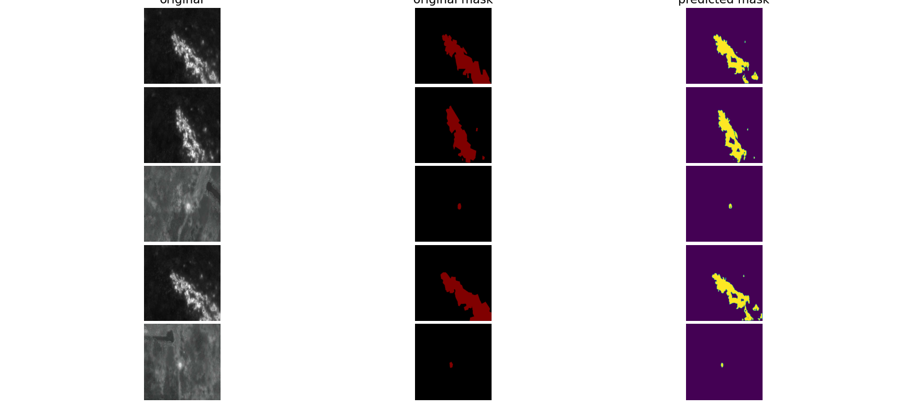

# UNET Segmentation-model-for-hotspot-detection

# Description

Real time hot spot/fire detection from aerial images. 
The approach consist of using segementation models to  hotspots in images

## Installation 
Dependencies can be installed using a conda enviroment with the ```enviroment.yml``` as follows
```bash
conda env create -n hotspot -f environment.yml
conda activate hotspot
```

## Mask Creation

Semantic Segmentation techniques require pixel wise annotations/masks. Labelling is often very tedious in order to help with this
Otsu's Adaptive threshold technique is used to provide the the image mask for training. This can be used as follows:
```bash
cd auto_annotations/
python save_masks.py -h

positional arguments:
  input_dir   directory to input images
  output_dir  created masks

optional arguments:
  -h, --help  show this help message and exit


```
After running this script you should have your generate image masks.

## Training

To train a model for hot spot detection run the following:

```bash

python train.py [-h] -d DATASET -o OUTPUT [-e EPOCHS] [-lr LEARNING_RATE]
                [-resume RESUME] [--batch_size BATCH_SIZE]
                            
 -d DATASET, --dataset DATASET
                        folder containing images and masks
  -o OUTPUT, --output OUTPUT
                        folder where weights would be stored
  -e EPOCHS, --epochs EPOCHS
                        number of epochs for training
  -lr LEARNING_RATE, --learning_rate LEARNING_RATE
                        number of epochs for training
  -resume RESUME        path to latest checkpoint (default: none)
  --batch_size BATCH_SIZE
                        batch size

```

## Evaluation 

To run inference on the trained model run the command as follows:
```bash

python evaluation.py [-h] -d DATASET -w WEIGHTS [-b BATCH_SIZE]

optional arguments:
  -h, --help            show this help message and exit
  -d DATASET, --dataset DATASET
                        folder containing images
  -w WEIGHTS, --weights WEIGHTS
                        paths to weights file
  -b BATCH_SIZE, --batch_size BATCH_SIZE
                        batch size
```

Example of the results are shown below:



## TO DO LIST

- [ ] dockerise application
- [ ] Investigate other CNN backbones for segmentation
- [ ] Fusion between rgb and thermal imagery for segmentation
- [ ] Implement user interface
- [ ] Bootstrapping/Bagging techniques to futher improve model acuracy


